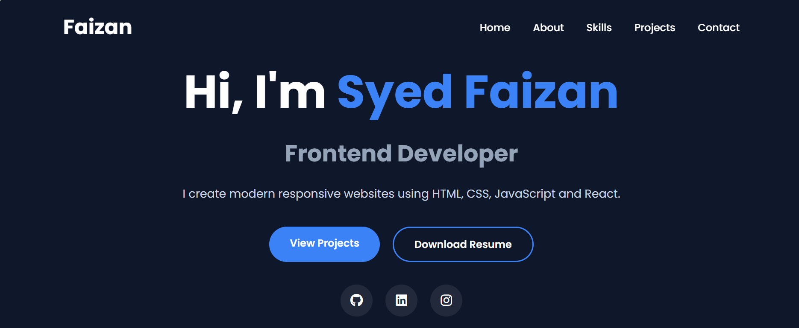
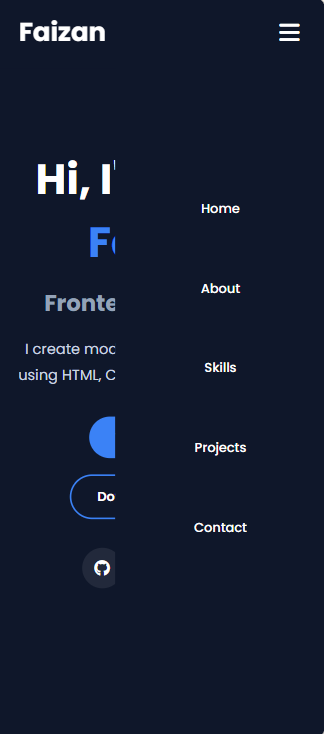

# Personal Portfolio Website

A modern responsive developer portfolio website built using HTML, CSS, and JavaScript.

## Features

- Responsive navbar with hamburger menu
- Hero section
- About section
- Skills showcase
- Projects section
- Contact section
- Active navbar highlighting
- Mobile responsive design
- Modern UI design
- GitHub and Live Demo links

## Technologies Used

- HTML5
- CSS3
- JavaScript

## Projects Included

- Modern Login Page
- Restaurant Website
- Admin Dashboard UI

## Screenshots

## Author

Syed Faizan